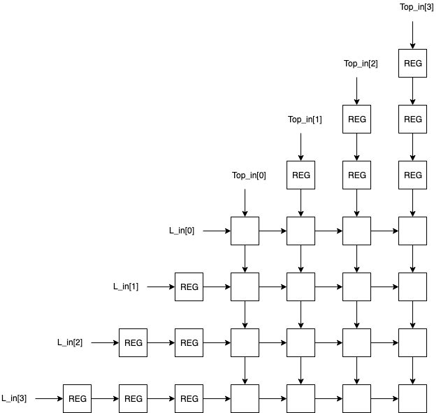

# Parameterizable  Systolic Array

Systolic array written in Python Migen that can be synthesized into verilog as shown below.
Systolic arrays can be used to multiply matrices by making an array of MACs(multiply accumulate units) in hardware.

Below is a picture of the default systolic provided in this repository. The ```ROWS```, ```COLS```, and bit ```WIDTH``` can be set as a top level parameter in ```gen_systolic_array_rtl.py``` and ```testbench.py``` if necessary.


```bash
$user@local make rtl
```
Verilog is written to ``_rtl_out/Systolic_Array.v``.

Snippet from ```_rtl_out/Systolic_Array.v```.

## Dependencies
 - python3
 - [nmigen](https://github.com/m-labs/nmigen)
 - [numpy] - for the testbench

## Testbench
Feeds two simple matrices into the systolic array.
The output is compared with the numpy.matmul() result.

```bash
$user@local make test

SYSTOLIC ARRAY OUTPUT:
[[ 56.  62.  68.  74.]
 [152. 174. 196. 218.]
 [248. 286. 324. 362.]
 [344. 398. 452. 506.]]

NUMPY OUTPUT:
[[ 56  62  68  74]
 [152 174 196 218]
 [248 286 324 362]
 [344 398 452 506]]

EXECUTED FOR 11 CYCLES
Verilog written to _sim_out/Systolic_Array.vcd
```

## Operation
To perform matrix multiplication A\*B, begin by placing the left most column of A at L_in and the top most row of B at Top_in. The next cycle, move once column to the right in A an place that at L_in. Also move one row down in B and place that at Top_in. Once you reach the last column of A or equivalently, the last row of B, insert 0s into Top_in and L_in so that the matrix product can percolate diagonally into the systolic array sums. After a sufficient amount of cycles, the matrix product will reside in the ```SUM``` registers of the systolic array cells.

Alternatively, you can begin another matrix multiplication, but note that the entire matrix product will never reside in the ```SUM``` registers of the systolic array cells. Instead, you will need a controller to diagonally scrape the sums of the systolic array cells while the products from the subsequent multiplication trickles in.

## TODO
 - [ ] make unit tests that take dimensions and arbitrary matrices as parameters
 - [ ] add example of diagonal scraping to testbench
